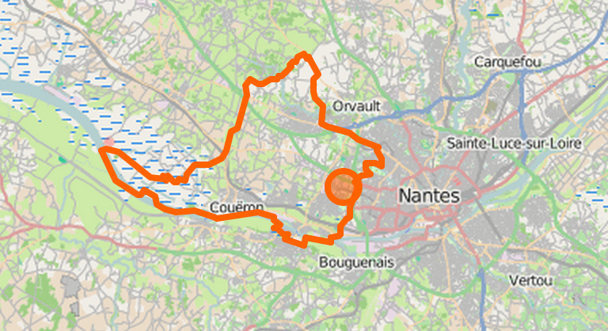

Open Data 44800
---------------

Public, Free, Open Data Resources for Saint-Herblain (44800, France)

License Information
-------------------

- [Open License](http://wiki.data.gouv.fr/images/9/9d/Licence_Ouverte.pdf) (fr)
- You can find a copy of this software here: https://github.com/WebDashAppDotIo/open-data-44800

Contributing Code
-----------------

- The issue queue can be found at https://github.com/WebDashAppDotIo/open-data-44800/issues
- All contributors will be fully credited.
- Just sign up for a [GitHub](https://github.com) account, create a fork and hack away at the codebase.
- Alternatively, submit patches/proposals/fix to: ronan.guilloux@gmail.com
